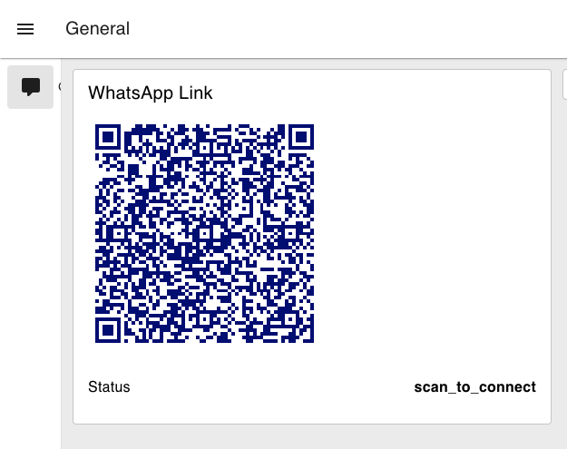
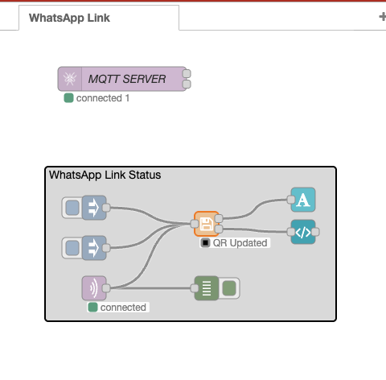

<div align="center">
    <br />
    <p>
        <a href="https://alphabits.team"></a>
    </p>
    <br />
    <h1>🚀 WhatsApp Link - Docker Edition</h1>
    <p>
        <i>Enterprise-Grade WhatsApp API Gateway by <strong>Alpha Bits</strong></i>
    </p>
    <br />
    <p>
        <a href="https://hub.docker.com/r/alphabits/walink-docker"></a>
        
        <a href="https://github.com/AlphaBitsCode/walink-docker"></a>
    </p>
    <br />
</div>

## 🎯 Quick Start for DevOps Engineers

### Docker Deployment
```bash
# Pull the image
docker pull alphabits/walink-docker:latest

# Run with default configuration
docker run -d \
  --name walink-gateway \
  -p 3000:3000 \
  alphabits/walink-docker:latest
```

### Environment Configuration
```bash
# Create .env file
cat > .env << EOF
# WhatsApp Configuration
WHATSAPP_SESSION_PATH=./sessions
WHATSAPP_QR_TIMEOUT=60

# MQTT Integration (Optional)
MQTT_ENABLE=true
MQTT_BROKER_URL=mqtt://mqtt-broker:1883
MQTT_INCOMING_TOPIC=whatsapp/incoming
MQTT_OUTGOING_TOPIC=whatsapp/outgoing

# Node-RED Integration
NODE_RED_URL=http://nodered:1880
EOF

# Run with environment file
docker run -d --env-file .env alphabits/walink-docker:latest
```

## 🔧 Node-RED Integration

### Dashboard Preview


### Flow Architecture


### Import Sample Flow
1. Open Node-RED Editor
2. Click **Menu → Import**
3. Copy the flow from `docs/sample-walink-flows.json`
4. Paste and click **Import**
5. Deploy the flow

## 📡 MQTT Message Protocol

### Incoming Messages (WhatsApp → MQTT)
**Topic:** `whatsapp/incoming`
```json
{
  "from": "1234567890@c.us",
  "body": "Hello World!",
  "type": "chat",
  "timestamp": 1634567890,
  "senderName": "John Doe"
}
```

### Outgoing Messages (MQTT → WhatsApp)
**Topic:** `whatsapp/outgoing`
```json
{
  "to": "1234567890@c.us",
  "body": "Hello from API!",
  "type": "chat"
}
```

## 🏗️ Architecture Overview

```
┌─────────────────┐    ┌─────────────────┐    ┌─────────────────┐
│   WhatsApp Web  │    │   Walink Docker │    │    Node-RED     │
│                 │◄──►│                 │◄──►│                 │
│  (Browser API)  │    │   (MQTT Bridge)  │    │  (Dashboard)    │
└─────────────────┘    └─────────────────┘    └─────────────────┘
                               │
                               ▼
                       ┌─────────────────┐
                       │   MQTT Broker   │
                       │                 │
                       │  (Message Bus)  │
                       └─────────────────┘
```

## 🚀 Production Deployment

### Docker Compose
```yaml
version: '3.8'
services:
  walink:
    image: alphabits/walink-docker:latest
    environment:
      - MQTT_ENABLE=true
      - MQTT_BROKER_URL=mqtt://mqtt:1883
    volumes:
      - ./sessions:/app/sessions
    depends_on:
      - mqtt

  mqtt:
    image: eclipse-mosquitto:2
    ports:
      - "1883:1883"

  nodered:
    image: nodered/node-red:latest
    ports:
      - "1880:1880"
    volumes:
      - ./data:/data
```

### Kubernetes Deployment
```yaml
apiVersion: apps/v1
kind: Deployment
metadata:
  name: walink-gateway
spec:
  replicas: 2
  selector:
    matchLabels:
      app: walink
  template:
    metadata:
      labels:
        app: walink
    spec:
      containers:
      - name: walink
        image: alphabits/walink-docker:latest
        env:
        - name: MQTT_ENABLE
          value: "true"
        - name: MQTT_BROKER_URL
          value: "mqtt://mqtt-service:1883"
```

## 🔒 Security Best Practices

- **Session Management**: Persistent sessions stored in volumes
- **MQTT Authentication**: Username/password authentication
- **Network Isolation**: Docker networks for service communication
- **Health Checks**: Container health monitoring
- **Resource Limits**: CPU and memory constraints

## 📊 Monitoring & Logging

### Health Check Endpoint
```bash
curl http://localhost:3000/health
```

### Container Logs
```bash
docker logs walink-gateway -f
```

### MQTT Topics Monitoring
```bash
mosquitto_sub -t "whatsapp/+" -v
```

## 🤝 Contributing

We welcome contributions! Please see our [contribution guidelines](CONTRIBUTING.md).

## 📄 License

This project is licensed under the Apache License 2.0. See [LICENSE](LICENSE) for details.

## 🏢 About Alpha Bits

[Alpha Bits](https://alphabits.team) is a leading provider of enterprise integration solutions, specializing in IoT automation, messaging platforms, and DevOps tools.

---

**Built for Devs by Devs 🧑🏻‍💻 [Alpha Bits](https://alphabits.team)**